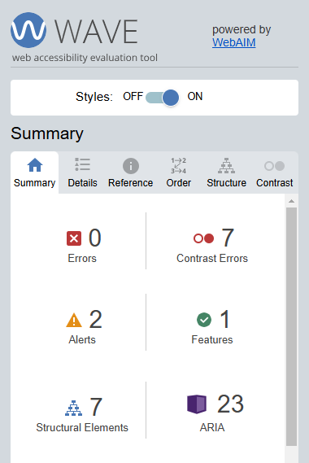
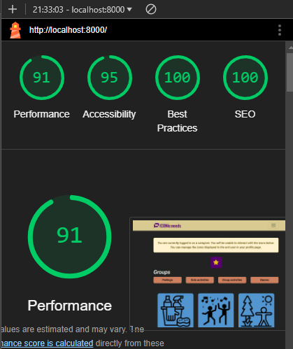
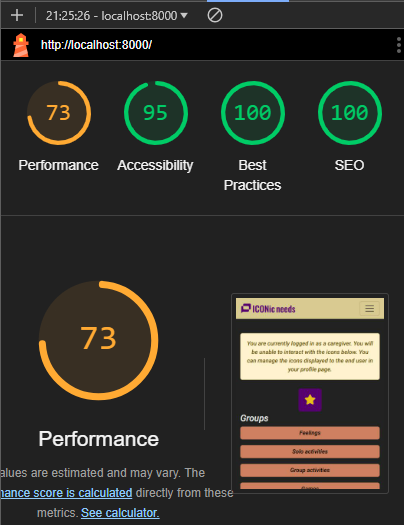
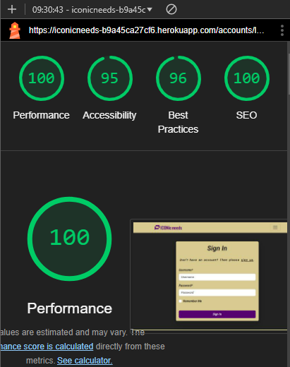
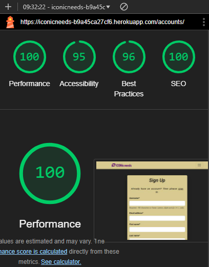
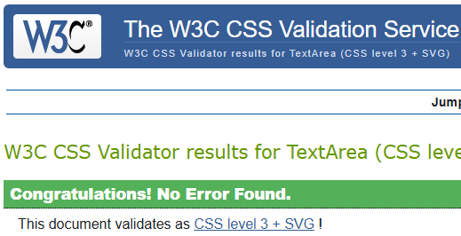

# ICONic needs

Code Institute November 2024 Hackathon entry by Axis of Access

[View deployed Heroku site](https://iconicneeds-b9a45ca27cf6.herokuapp.com/)


**Needs expressed to be heard**

Our website is designed to give individuals with intellectual disabilities an easy and clear way to express their needs. By clicking on icons representing common requests and needs, such as hungry, tired, go outside, take a bath.

The user can quickly and easily communicate their needs to their caregiver. This tool helps both the user and the caregiver have a safer and more efficient daily routine, where the user feels heard and understood.


[Link to live site](https://iconicneeds-b9a45ca27cf6.herokuapp.com/)

## Features

### Existing features
#### Icon-Based Communication System
Variety of Icons: A wide range of icons representing common needs (e.g., hunger, tiredness, emotions, activities) that users can select.

Customizable Icons: The cargiver has the ability to add or modify icons to cater to the user’s personal needs.

Categorized Icons: Caregiver can organized the icons into clear categories like "Basic Needs", "Emotions", "Activities", etc.

#### Simple User Interface (UI)
Large, Easy-to-Click Icons: Icons are clear, big, and visually intuitive, making it easy for users with limited motor skills to navigate.

Text Labels: Icons include text labels to provide clarity and support for those who can read.

Visual Feedback: Provides visual confirmation by slightly enlarging the chossen icon and change its color.

#### Message Notification System
Automatic Notifications: When an icon is clicked, an automated message is sent to the caregiver’s device (e.g., mobile, tablet, or computer).
Message Details: The notification include the title of the icon, eg. "hungry" or "tired" and the time when the icon was clicked by the user.

#### Caregiver Tools
Caregiver Access: Caregivers can receive notifications from the user. And caregiver can add, edit and delete icons to meet the user's needs.

Favorite Icons: Users can mark icons they frequently use as "favorites" for quick access.

#### Security and Privacy
Secure Login: Password-protected access for caregivers and users to maintain privacy and data security.

#### Support for Multiple Devices
Cross-Platform Compatibility: Accessible on smartphones, tablets, and desktops to ensure ease of use across different devices.

### Features for the future
Text-to-Speech: Text on icons can be read aloud to assist those with vision or reading difficulties.

Language Options: Multiple languages to accommodate users and caregivers from different linguistic backgrounds.

High Contrast Mode: Visual support for users with visual impairments by enabling a high-contrast design.

Switch for dark and light mode: The user can choose if they prefer dark mode or light mode.

Feedback System: Users can give feedback (e.g., "I feel better" or "This worked") to indicate if their need has been addressed.

Activity Log: History of requests made by the user, which can be useful for long-term care planning.

Multiple Requests: Users can select multiple icons at once if they have more than one need.

Emotion Tracking: Track emotional status over time, helping caregivers understand patterns (e.g., frequent "angry" or "tired" requests).

Care Plan Integration: Allow caregivers to tailor responses based on the individual’s care plan and specific needs.

Data Encryption: Encrypting all communication to protect sensitive information.

Anonymous Usage: For individuals who do not want to share personal information, the platform could allow anonymous use.

## Accessability
The website is simple and clear, with large, icons representing different needs, such as "hungry," "tired," and "sad." Each icon has a short text to clarify its meaning. The user taps on the icons to express their needs. The design is clean, with large buttons and enough space to prevent mistakes. There is a confirmation sound when an icon is tapped. The colors are contrasting, but still soft and easy to read. Everything is designed to be easy to use with both touch screens and a mouse.
--------The website is also keyboard accessible.

### Accessability testing
**[WAVE Web Accessibility Evaluation Tools](https://wave.webaim.org/)**


<details>
    <summary>WAWE</summary>
        
</details>

**Lighthouse**





<details>
    <summary>Lighthoues</summary>
    
</details>


**[Web Content Accessibility Guidelines (WCAG)](https://www.w3.org/TR/WCAG22/)**

We have reviewed parts of the guidelines and can conclude that much more work can be done on the website to make it even more accessible. Due to the limited development time, during a hackathon, we were only able to fulfill some of the requirements. For future improvements, the WCSG will be continuously followed.

Examples of features that needs improvement to meet WCAG:
-------- Make sure everything works for keyboard-only users
- Make it easy for people to log in without having to remember information
- Except for captions and images of text, text can be resized without assistive technology up to 200 percent without loss of content or functionality.
- More examples can be found at [features for the future](#features-for-the-future).

## Design
The index page, or homepage, displays a set of icons meant to express emotions or activities. If a user does not have an account and is therefore not logged in, they can still click on the icons, triggering a sound signal. This allows the webpage to function in such a way that someone with an intellectual disability can press the icons, and if a caregiver is in the same room, they will hear a signal indicating that the user has expressed a need.

There is a register page where both the user and caregiver can sign up. The user needs to register an account in order to be linked to their caregiver. Beyond this, the user's profile account has no additional features, apart from allowing the user to log out and return to the homepage.

The caregiver's profile page includes functionality to add, delete, mark icons as favorites, and change the names and group affiliations of the icons. On the caregiver's profile page, the linked user is also displayed. When the linked user clicks on an icon, the caregiver receives a notification about which icon was clicked. The notification bell symbol on the caregiver's profile page also indicates if there are unread notifications by displaying a number corresponding to the count of unread notifications.

### User Stories
For user stories and agile work process, please look at the [project's kanban board](https://github.com/users/aslinedvinsson/projects/9)

### Media
We have consciously not used blinking or flashing content as it can cause migraines, dizziness, nausea, and seizures. This complies with WCAG  Seizures and Physical Reactions guidlines

### Colors
We took the help of [Venngage](https://venngage.com/blog/accessible-colors/#examples) to find accessible colors.
The choosen accessible color palette is dark to light


### Fonts
-------- add fonts


### Typography
------**Textspacing** Do we comply?????
Comply with the WCAG Text Spacing guidelines
Line height (line spacing) to at least 1.5 times the font size;
Spacing following paragraphs to at least 2 times the font size;
Letter spacing (tracking) to at least 0.12 times the font size;
Word spacing to at least 0.16 times the font size.

### Icons
The site uses icons from [Free Pik]( https://www.freepik.com ) and [pixabay](https://pixabay.com)

------ Favicon comes from... -------

### Wireframes

<details open>
    <summary>Home page</summary>
    
</details>

<details>
    <summary>User profile page</summary>
    
</details>

<details>
    <summary>Caregiver page</summary>
    
</details>

<details>
    <summary>Registration page</summary>
    
</details>

### Custom Models and Database design ERD
The **UserProfile model** manages users with two roles: CareGiver (CG) and EndUser (EU). It links to the User model via a one-to-one relationship and includes common fields like name, email, about, and created_at. The role field distinguishes between CareGivers and EndUsers, with a ForeignKey linking EndUsers to their CareGiver. The model allows CareGivers to manage multiple EndUsers while ensuring clear role-based associations.

| Field Name    | Type           | Constraints                           | Description                                           |
|---------------|----------------|---------------------------------------|-------------------------------------------------------|
| id            | Primary Key    | Auto-increment                        | Unique identifier for each record                    |
| user          | Foreign Key    | Related to AUTH_USER_MODEL            | Links to the user authentication model               |
| name          | CharField      | Max length 100                        | Name of the user                                      |
| email         | EmailField     | Unique                                | Email address (unique for each user)                 |
| role          | CharField      | Choices: `CG` (Caregiver), `EU` (EndUser) | Specifies the role of the user (Caregiver or EndUser)|
| about         | TextField      | Optional                              | Additional information about the user                |
| created_at    | DateTimeField  | Auto-set on creation                  | Timestamp when the user profile was created          |
| caregiver     | Foreign Key    | Nullable, Self-referencing            | References another `UserProfile` as a caregiver      |

**Relationships**
1. **user**: One-to-One relationship with the Django `AUTH_USER_MODEL`.
2. **caregiver**: Self-referencing ForeignKey, where a Caregiver (`role=CG`) can have multiple EndUsers (`role=EU`).

The **Group model** represents categories of icons (e.g., "Basic Needs", "Emotions") with a unique name and an optional description.

| Field Name    | Type           | Constraints                           | Description                                           |
|---------------|----------------|---------------------------------------|-------------------------------------------------------|
| id            | Primary Key    | Auto-increment                        | Unique identifier for each group                     |
| caregiver     | Foreign Key    | Related to `UserProfile` (`role=CG`)  | Links to the caregiver who owns the group            |
| name          | CharField      | Max length 50, Unique                 | Unique name of the group, e.g., "Basic Needs"        |
| description   | TextField      | Optional                              | Additional description about the group               |


The **Icon model** represents icons used by EndUsers to communicate with CareGivers. Caregivers can create and manage icons, each associated with a name, image, and optional group. Icons can be marked as default or active, and are linked to a Group. Only Caregivers can own icons, and the model supports hiding/unhiding icons based on the is_active field.

| Field Name    | Type           | Constraints                           | Description                                           |
|---------------|----------------|---------------------------------------|-------------------------------------------------------|
| id            | Primary Key    | Auto-increment                        | Unique identifier for each icon                      |
| caregiver     | Foreign Key    | Related to `UserProfile` (`role=CG`)  | Links to the caregiver who owns the icon             |
| name          | CharField      | Max length 100                        | Name of the icon, e.g., "Hungry", "Thirsty"          |
| image         | CloudinaryField| Required                              | Stores the icon's image in Cloudinary                |
| is_default    | BooleanField   | Default=False                         | Indicates if the icon is a system default            |
| is_active     | BooleanField   | Default=True                          | Indicates if the icon is visible to the end user     |
| is_favorite   | BooleanField   | Default=False                         | Marks if the icon is a favorite                      |
| group         | Foreign Key    | Nullable, Related to `Group`          | Links the icon to a specific group                   |


The **Notification model** represents a notification sent by a CareGiver to a user, linked to an icon. It includes a caregiver (who sends the notification), a user (who receives it), and an icon (representing the type of notification). The model also tracks when the notification was sent (notified_at) and whether it was successfully sent (is_sent).

| Field Name    | Type           | Constraints                           | Description                                           |
|---------------|----------------|---------------------------------------|-------------------------------------------------------|
| id            | Primary Key    | Auto-increment                        | Unique identifier for each notification              |
| caregiver     | Foreign Key    | Related to `UserProfile` (`role=CG`)  | The caregiver receiving the notification             |
| user          | Foreign Key    | Related to `UserProfile` (`role=EU`)  | The user who triggered the notification              |
| icon          | Foreign Key    | Nullable, Related to `Icon`           | The icon selected by the user                        |
| notified_at   | DateTimeField  | Auto-set on creation                  | The time when the notification was created           |
| is_sent       | BooleanField   | Default=False                         | Whether the notification has been sent               |
| is_viewed     | BooleanField   | Default=False                         | Whether the notification has been viewed             |

## Security Features and Defensive Design

### User Authentication
User authentication is applied to protect user data and prevent unauthorized access. During registration, users create a unique username and a strong password, following stringent security requirements. The login process securely verifies these credentials.

### Form Validation
Should a form be submitted with incorrect or missing information, it will not proceed, and the user will receive a notification identifying the field that triggered the error.

### Database Security
The env.py file securely stores the database URL and secret key to safeguard against unauthorized database access, a setup established prior to the initial push to GitHub.

To enhance site security, Cross-Site Request Forgery (CSRF) tokens have been implemented across all forms.

### Error Page
404 - Page Not Found error page was created to guide them back to the site.

## Testing

### Lighthouse Score
**Lighthouse**: Google Lighthouse is a web performance and SEO auditing tool that analyzes web pages, providing detailed reports and recommendations for improving page speed, accessibility, and user experience. [Lighthouse](https://developer.chrome.com/docs/lighthouse/overview/)

#### SignIn page



#### SignUp page



#### First page


### HTML Validator
**HTML Validation Service**: A tool to check the markup validity of Ib documents in HTML. [HTML Validation](https://validator.w3.org/)

| Template tested     | Test result |
| :-----------------: | :---------: |
| Landing page        | Pass        |
| Log in page         | Pass        |
| Sign up page        | Pass        |
| User dashboard      | Pass        |
| User profile        | Pass        |
| Carer dashboard     | Pass        |
| Carer notifications | Pass        |

### CSS Validator
**CSS Validation Service**: A service to check the validity of Cascading Style Sheets (CSS). [CSS Validation](https://jigsaw.w3.org/css-validator/)




### JavaScript Validator
**JSHint**: A tool for linting JavaScript. [JS Hint](https://jshint.com/)

| JS file tested                                 | Test result |
| :-------------------------------------------:  | :---------: |
| static/main.js                                 | Pass        |
| notifications/templates/notificationindex.html | Pass        |

The only errors came from Bootstrap's tooltip initializer and from ES6 syntax.

### Python Validator
**CI Python Linter**: A Code Insitute tool to validate Python. [CI Python Linter](https://pep8ci.herokuapp.com/)

| Python file tested          | Test result |
| :------------------------:  | :---------: |
| accounts/admin.py           | Pass        |
| accounts/apps.py            | Pass        |
| accounts/forms.py           | Pass        |
| accounts/models.py          | Pass        |
| accounts/tests.py           | Pass        |
| accounts/urls.py            | Pass        |
| accounts/views.py           | Pass        |
| communication/admin.py      | Pass        |
| communication/apps.py       | Pass        |
| communication/models.py     | Pass        |
| communication/tests.py      | Pass        |
| communication/urls.py       | Pass        |
| communication/views.py      | Pass        |
| notifications/admin.py      | Pass        |
| notifications/apps.py       | Pass        |
| notifications/models.py     | Pass        |
| notifications/tests.py      | Pass        |
| notifications/urls.py       | Pass        |
| notifications/views.py      | Pass        |

### Manual Testing
[User Acceptance Testing and Functional Testing](manual_testing.md)

------check so the information still is correct in the manual testing.

## Bugs/Issues
- Paths in the `urls.py` files of the **Notification** and **Communication** apps had the same name `'index'`, causing conflicts in link resolution.
- Currently only super user who has user Profile as care giver gets notificationn from end users.But a Care Giver whose profile is created from the website and has been assigned an end user doesn't get any notification. 
### Resolved Bugs/Issues
- The paths in the `urls.py` files were renamed to different names to avoid conflicts.
### Unresolved Bugs/Issues
----- any?
## Deployment

### Deploying a Django Project on Heroku
Heroku is a cloud platform service that enables developers to build, run, and operate applications entirely in the cloud. [Heroku](https://id.heroku.com/)
Here is how to use it:
- Create an account or log in to **Heroku**.
- On the dashboard, click on **"New"** and select **"Create new app"**.
- Give the app a unique name and select the region closest to you. Then click **"Create app"** to confirm.

**Settings**

1. **Update `settings.py`**:
   - Set `ALLOWED_HOSTS`:
     ```python
     ALLOWED_HOSTS = ['your-app-name.herokuapp.com']
     ```
   - Install `whitenoise` for handling static files:
     ```bash
     pip install whitenoise
     ```
     Add it to your middleware:
     ```python
     MIDDLEWARE = [
         'whitenoise.middleware.WhiteNoiseMiddleware',
         # other middleware...
     ]
     ```
     Configure static files:
     ```python
     STATIC_ROOT = BASE_DIR / 'staticfiles'
     ```
     Run `python manage.py collectstatic` during deployment.
   - Install `psycopg2` and `dj-database-url` for database configuration:
     ```bash
     pip install psycopg2 dj-database-url
     ```
     Update database settings:
     ```python
     import dj_database_url
     DATABASES = {'default': dj_database_url.config()}
     ```
   - Set `DEBUG = False` and move `SECRET_KEY` to Config Vars.

2. **Install Gunicorn**:
   - Install Gunicorn:
     ```bash
     pip install gunicorn
     ```
   - Create a `Procfile` in the root directory:
     ```
     web: gunicorn your_project_name.wsgi
     ```

3. **Config Vars**

      a. Go to your app's **Settings** tab on Heroku.

      b. Click **"Reveal Config Vars"** and add the following:
         - `SECRET_KEY`: A secure Django secret key.
         - `DATABASE_URL`: Automatically set if using Heroku Postgres.
         - `DEBUG`: Set to `False`.

      c. Access these variables in `settings.py`:
          ```python
          import os
          SECRET_KEY = os.getenv('SECRET_KEY', 'fallback-key')
          DEBUG = os.getenv('DEBUG', 'False') == 'True'

### Forking repository
- Forking enables you to create a personal copy of an existing repository on a remote server. To do so with the specified repository:

- Navigate to the **[repository](https://github.com/aslinedvinsson/Axisofaccesshack)** on GitHub.
- Click on the **"Fork"** button located at the top right corner of the page.
- This action will generate a copy of the repository under ythe own GitHub account.

## Tools/Technologies

### Languages
* HTML5 - Provides the content and structure for the website.
* CSS - Provides the styling for the website.
* Python - Provides the functionality for the site.
* Django - Used as the Python framework for the website.
* Javascript - Adds interactivity and dynamic features to the website.

### Frameworks and Libraries
- **Django**: A high-level Python framework that enctheages rapid development and clean, pragmatic design. [Django](https://www.djangoproject.com/)
- **Bootstrap**: A front-end framework for developing responsive and mobile-first websites. [Bootstrap](https://getbootstrap.com/)
- **Psycopg2**: A PostgreSQL adapter for Python. [Psycopg2](https://pypi.org/project/psycopg2/)
- **Gunicorn**: A Python WSGI HTTP Server for UNIX, used to run Python Ib applications. [Gunicorn](https://gunicorn.org/)

### Code
The Code Institute's repository boilerplate for Gitpod was utilized.

### Other Tools
------ something else?

## Credits
------ some more?

WCAG for their outstanding guidelines

### Disclaimer
The content available on this site is solely for hackathon purpose and should not be interpreted as a professional tool.